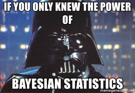
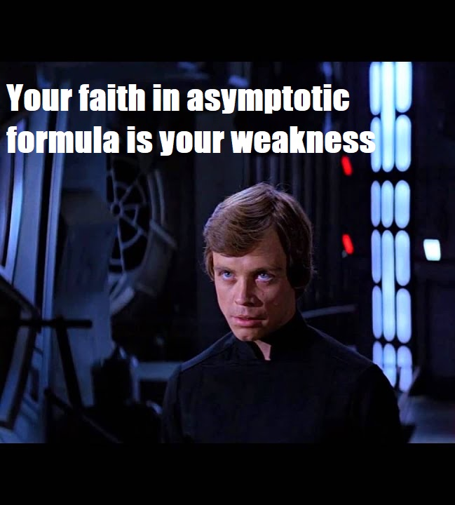
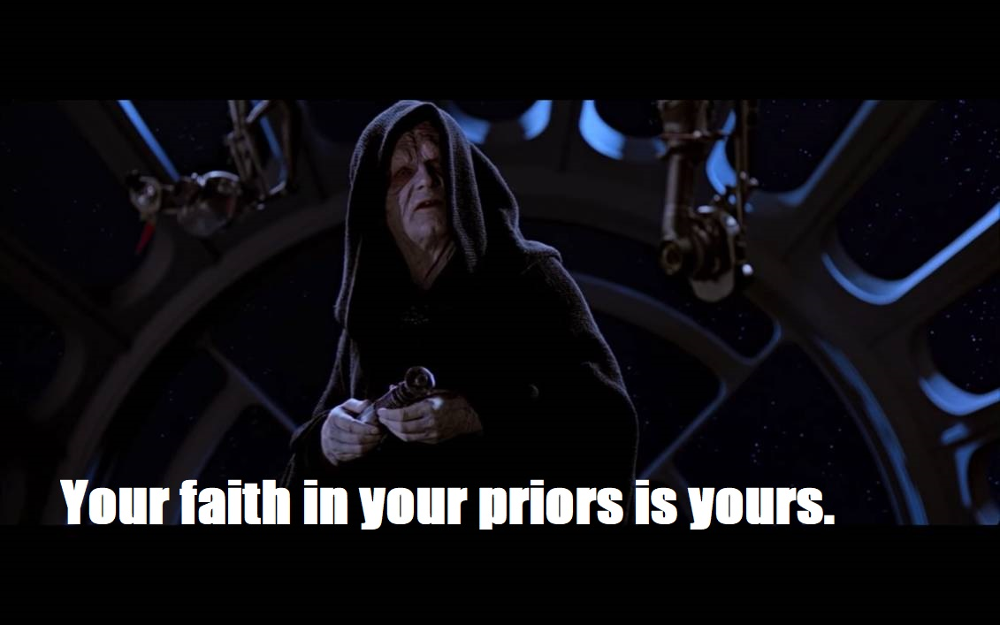
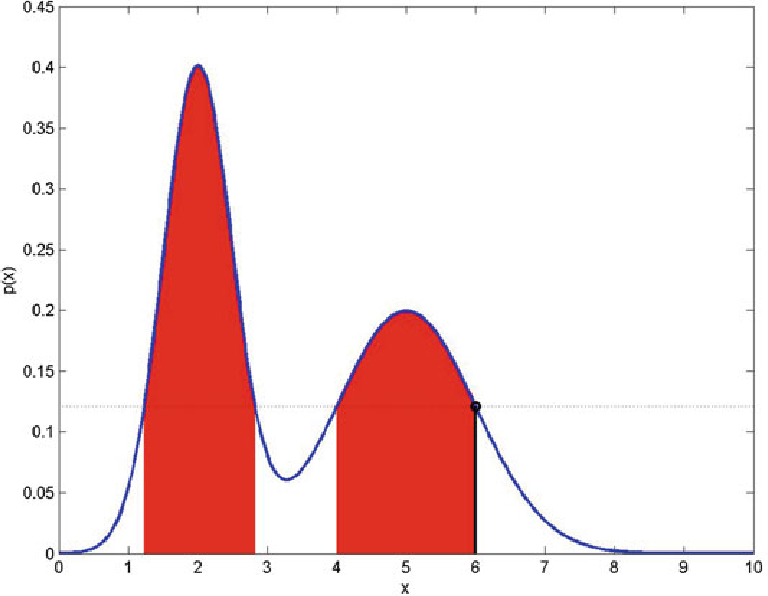
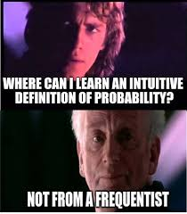
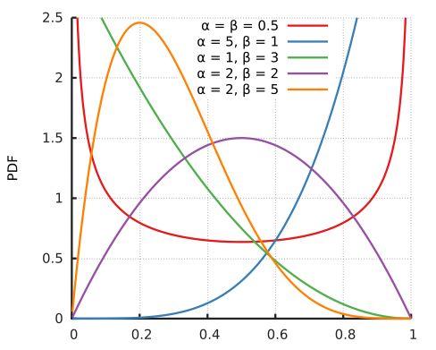
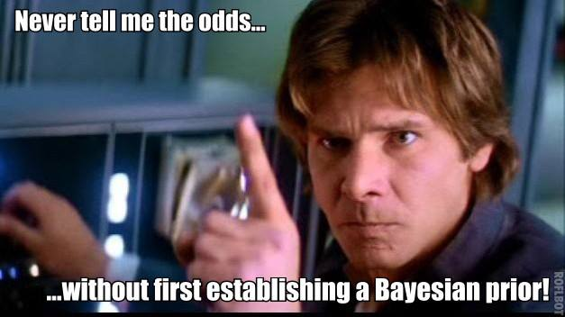
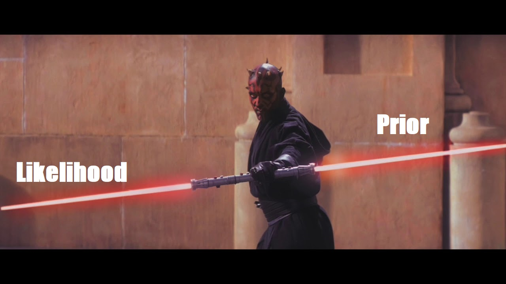

```{r Lec1, echo=FALSE, warning=FALSE, message=FALSE, cache=FALSE}
#source("../assets/lec_first_chunk.R")

library(rmarkdown)
library(knitr)

suppressPackageStartupMessages(library(tidyverse))
suppressPackageStartupMessages(library(ggplot2))
suppressPackageStartupMessages(library(here))

suppressPackageStartupMessages(library(rethinking))

options(digits = 6)
 
set.seed(1)
```

$$
\require{color}
\definecolor{prior}{RGB}{248,118,109}
\definecolor{like}{RGB}{0,186,56}
\definecolor{post}{RGB}{97,156,255}
\definecolor{margin}{RGB}{199,124,255}
$$
 

### Outline
  
* Comparing Frequentist and Bayesian Philosophies

* Conditional probability refresher

* From Bayes theorem to Bayesian inference.

* Empire Strikes Back example I.

* Bayesian Inference for a normal sample (known variance).

* Shiny app.

* Empire Strikes Back example II.

* Bayesian hypothesis testing.


  
---

### Warning

.pull-left[ 
* Bayesian inference is a very powerful paradigm for performing statistical inferences.

* It has analogous quantities for point estimation, confidence intervals and hypothesis testing.

* Most Bayesian inference requires the approximation of intractable integrals or combinatorial sums.

* Simulation methods are used to perform these approximations.

* Several packages can be used to do this for us.
]

.pull-right[

]

---

class: segue


.white[

In our reasoning concerning matter of fact, there are all imaginable degrees of assurance,
from the highest certainty to the lowest species of moral evidence. A wise [person], therefore,
proportions [their] belief to the evidence.

– David Hume

]


---


class: segue


.white[

# From frequentist to Bayesian inference

]


---

 
.pull-left-2[

### The rationale of Frequentist inference

In frequentist inference estimators of parameters functions of random
draws from a particular distribution, e.g.,
\begin{align}
\widehat{\mu} = f(X_1,\ldots,X_n) = \overline{X}
\end{align}

where, say,
\begin{align}
X_i \stackrel{iid}{\sim} N(\mu,\sigma^2), \qquad i=1,\ldots,n
\end{align}

(with $\sigma^2$ known) and
$f(X_1,\ldots,X_n) = \frac{1}{n}\sum_{i=1}^n X_i$.

Properties of the estimator are determined by how $f(X_1,\ldots,X_n)$
behaves in expectation/variance, or as $n$ becomes large.
]

.pull-right-1[

<br>

<br>

```{r, eval=TRUE, echo=FALSE, fig.width=5, fig.height=6}
nmax <- 30
mu <- 0
sigma <- 5
xg <- seq(-5,5,,100)
dat <- c()
for (n in 1:nmax) 
{
  yg      <- dnorm(xg,mu,sigma/sqrt(n))
  dat_bit <- cbind(xg,yg,n)
  dat     <- rbind(dat,dat_bit)
}
colnames(dat) <- c("x","y","n_val")
tib <- as_tibble(dat)

library(gganimate)
g <- ggplot(tib,aes(x=x,y=y)) +
  geom_line(size=1.5) +
  theme_bw(base_size = 22) + 
  coord_cartesian(xlim = c(-5,5)) +
  labs(x='X bar',y='density', title = "n: { round(frame_time) }")  +
  transition_time(time=n_val) 
g
```
]

---

### The Postulates of Frequentist inference

.pull-left-2[


 
.small[
In frequentist inference the properties of estimators are judged on their behaviour if the experiment leading to the recorded data were repeated over and over.

Wasserman (2003) states the following postulates of frequentist inference:

* Probability refers to **limiting relative frequencies**. Probabilities are objective properties
of the real world.

* Parameters are fixed unknown constants. Because they are not fluctuating, **no
useful probability statements can be made about parameters**.


* Statistical procedure should be designed to have well-defined **long run frequency
properties**. For example, a 95% confidence interval should trap the true vale of
the parameter with a limiting frequency at least 95%.

]

]

.pull-right-1[

<br>


]


---

.pull-left-2[

### The rationale of Bayesian inference

Bayesian inference takes things one  step further. 
Since $\widehat{\mu}=\sum_{i=1}^n X_i/n$ is random why not model 
uncertainty about the location $\mu$ using probability?

The model is then treated as a conditional probability or conditional
statement about the data (the $X_i$'s) conditional on the parameter(s), e.g., $\mu$.

We can then state a distribution for $\color{prior}{p(\mu)}$ called the .prior[prior distribution].

We Bayes theorem
to derive the distribution of $\mu$ conditional on the observed sample
$x_1,\ldots,x_n$, i.e., ${\color{post} p(\mu|{\bf x})}$ called the .post[posterior distribution]
\begin{align}
\displaystyle {\color{post} p(\mu|{\bf x})} = \frac{\left[ 
{\color{like} \prod_{i=1}^n p(x_i|\mu)} \right]{\color{prior} p(\mu)}}{\int_{-\infty}^\infty \left[ \color{like}{\prod_{i=1}^n p(x_i|\mu)} \right]{\color{prior} p(\mu)} d\mu}
\end{align}
]

.pull-right-1[

<br>

<br>

```{r, eval=TRUE, echo=FALSE, fig.width=5, fig.height=6}
nmax <- 20
mu <- 0
sigma <- 5

xg <- seq(-5,15,,100)
x <- rnorm(nmax,mu,sigma)

x_bar <- mean(x)
se    <- sigma/sqrt(n)
se2   <- se^2

a <- 5
b2 <- 3
b <- sqrt(b2)

w <- (1/se2)/(1/se2 + 1/b2)

post_mean <- w*x_bar + (1 - w)*a
post_var  <- 1/(1/se2 + 1/b2)
post_se   <- sqrt(post_var)

f_prior <- dnorm(xg,a,b)
f_like  <- dnorm(xg,x_bar,se)
f_post  <- dnorm(xg,post_mean,post_se)

dat1 <- cbind(xg,f_prior,1)
dat2 <- cbind(xg,f_like,2)
dat3 <- cbind(xg,f_post,3)
dat <- rbind(dat1,dat2,dat3)

colnames(dat) <- c("x","y","density")
df <- data.frame(dat)
df[,3] <- factor(df[,3],levels=c(1,2,3),labels=c("prior","likelihood","posterior"))

g <- ggplot(df,aes(x=x,y=y,color=density)) +
  geom_line(size=1.5) +
  theme_bw(base_size = 22) +
  theme(legend.position="bottom", legend.direction="vertical") +
  coord_cartesian(xlim = c(-3,10)) +
  labs(x='x',y='density', title = "Bayesian inference") 
g
```
]

---


### Reverend Thomas Bayes (1701 - 1761)

.pull-left-2[

* Born in Hertfordshire (*London, England*),

* was a Presbyterian minister,

* studied: theology and mathematics,

* best known for *Essay Towards Solving a Problem in the Doctrine of Chances*

* where *Bayes' Theorem* was first proposed.
\begin{align}
P(A=a|B=b) = \frac{P(B=b|A=a)P(A=a)}{P(B=b)}
\end{align}

* Words: **Bayes' rule**, **Bayes' Theorem**, **Bayesian Statistics**.
 


]

.pull-right-1[

<br>


]

---

.pull-left-2[
### Postulates of Bayesian inference

.small[

Wasserman (2003) states the following postulates of Bayesian inference:


* Probability describes **degree of belief**, not **limiting frequency**. As such we can
make probability statements about lot of things, not just data which are subject
to variation. For example, I might say that **"the probability that Albert Einstein
drank a cup of tea on August 1, 1948" is 0.35**. This does not refer to any limiting
frequency. If reflects my strength of belief that the proposition is true.

* We can make probability statements about parameters, even though they are
fixed constants.

* We make inferences about a parameter $\mu$ by producing the probability distribution
for $\mu$. Inferences, such as point estimates and interval estimates, may be extracted
from this distribution.

]
]


.pull-right-1[


]


---


.pull-left-2[


### Controversy

.small[
* From the above statements we can see that the reason that Bayesian inference is
so controversial because it adopts **a subjective notion of probability**. Consequently:

  * Bayesian inferences may be considered subjective rather than objective and subject
  to the user's biases.

  * Bayesian methods do not make guarantees on the long term performance of procedures.
  
* Putting philosophical issues aside Bayesian methods for many aspects of inference
have been developed analogously to those developed for frequentist inference. Hence,
Bayesian methodology has its own versions of 

  * point estimation, 
  
  * confidence intervals and 
  
  * hypothesis testing. 
]

]

.pull-right-1[

<br>





 

]

---

class: segue

.white[
# Bayes theorem - Conditional probability refresher
]

---

### Bayes theorem - Conditional probability refresher

Let's again start with Bayes theorem

$${\color{post} P(A=a|B=b)} = \frac{{\color{like} P(B=b|A=a)}{\color{prior} P(A=a)}}{{\color{margin} P(B=b)}}$$

To save writing we will write this as

$$P(A|B) = \frac{P(B|A)P(A)}{P(B)}$$
---

### The Product Rule

.pull-left[
Discrete case

+ Product rule:

$$P(A,B) = P(B)P(A|B) = P(A)P(B|A)$$

+ Independence:
$$P(A,B) = P(A)P(B|A) = P(A)P(B)$$


+ Sum Rule: If $-A$ is the negation of $A$ then

$$P(B) = P(A,B) + P(-A,B)$$

+ Sum Rule: If one of $\{ A_1, A_2,\ldots, A_K\}$ is true:

$$P(B) = P(A_1,B) + P(A_2,B) + \ldots + P(A_K,B)$$

]


.pull-left[
Continuous case

+ Product rule:

$$p(a,b) = p(b)p(a|b) = p(a)p(b|a)$$

+ Independence:

$$p(a,b) = p(a)p(b|a) = p(a)p(b)$$


+ "Sum" Rule: 
$$p(b) = \int p(a,b) da$$

 

]

---

class: segue

.white[
# From Bayes theorem to Bayesian inference
]

---

.pull-left[
Let's again start with Bayes theorem:

$${\color{post} P(A=a|B=b)} = \frac{{\color{like} P(B=b|A=a)}{\color{prior} P(A=a)}}{{\color{margin} P(B=b)}}$$
 
Suppose we have

+ ${\bf x}$ our data and $\theta$ our parameter.

+ $L(\theta) = p({\bf x}|\theta)$ the likelihood as a function of $\theta$ for our data

+ $p(\theta)$ a density for our data representing our uncertainty about the location of $\theta$ before
we have seen any data.

We want the **posterior distribution** of $\theta$:

$$p(\theta|{\bf x})$$

which represents the uncertainty around the location of $\theta$ after we observed ${\bf x}$,

]

.pull-right[

\begin{align}
{\color{post}p(\theta|{\bf x})}
& = \frac{{\color{like}p({\bf x}|\theta)}{\color{prior}p(\theta)}}{{\color{margin}p({\bf x})}} \\ 
& = \frac{{\color{like}L(\theta)}{\color{prior}p(\theta)}}{{\color{margin}p({\bf x})}} \\
& = \frac{\mbox{Likelihood} \times \mbox{Prior}}{\mbox{Marginal}}
\end{align}


We made the interchanges

+ ${\bf x} \leftrightarrow \{B=b\}$.

+ $\theta  \leftrightarrow \{A=a\}$.

+ Replace probabilities with densities.

Then ${\color{margin}p({\bf x})}$ is obtained by integrating

$${\color{margin}p({\bf x})} = \int {\color{like}L(\theta)}{\color{prior}p(\theta)} d\theta$$

]

---

### Posterior quantities of interest

The posterior distribution summarises the information we have about a 
model parameter after we have observed data.

Quantities of this distribution can be summarised just like any other 
distribution.

* Point estimates. We could use the posterior to calculate measures of location. For example

  * Posterior mean: 
  $\mathbb{E}({\color{post} \theta|{\bf x}})$.
  
  * Posterior mode: $\ds \max_{\theta} \ {\color{post}p(\theta|\vx)}$.
  
  * Posterior median: $Z$ such that $p({\color{post}\theta<Z|\vx})=1/2$.

* Posterior variance: $\mbox{Var}({\color{post}\theta|\vx})$.

* Posterior "confidence intervals" (more on this next slide). 

$$\left\{ (a,b)\ \colon\ P(a<\theta<b|{\bf x}) = 0.95 \right\}.$$


For known densities many of these properties are easily available from Wikipedia
or may be easily calculated using `R` functions.

---

### Bayesian credible intervals

.pull-left[

A Bayesian 95% credible interval for a parameter $\theta$ is any interval $(a,b)$ such that

$$\left\{ (a,b)\ \colon\ P(a<\theta<b|{\bf x}) = 0.95 \right\}$$

noting that there is infinite ways $a$ and $b$ can be chosen
to satisfy. The values of $(a,b)$ can be chosen using symmetry (in some cases)
or using the **highest posterior density interval**.

<center>

</center>


]

.pull-right[

Note that this definition of a credible interval is much more
intuitive than a confidence interval.



]

---

### Not on interpretation

While posterior probabilities are more interpretable (more on this later),
a little care should be taken interpreting Bayesian quantities.

Suppose we have $P(\theta\in{\mathcal S}|{\bf x}) = 0.35$.

This is not the same as saying 

> The probability of $S$ given the data is 35 percent.

It is saying given

  (A) a model for the data;

  (B) a prior for the model parameters; and

  (C) the data itself

that the **posterior probability** of an event $S$ given data is 35 percent.

Statements about posterior distributions and probabilities are implicitly assuming (A)-(C).

---

class: segue

.white[

# Example - Star Wars: Empire strikes back 

# Adpated from COUNT BAYESIE's blog.
]


 
---

### Aside - Beta distribution

.pull-left-2[

The Beta distribution is a useful distribution for modelling
uncertainty about probabilities since random draws from
the Beta distribution are on the interval $[0,1]$.

The Beta distribution given by
\begin{align}
p(\theta;\alpha,\beta) 
& = \frac{\theta^{\alpha-1}(1-\theta)^{\beta-1}}{\mathcal{B}(\alpha,\beta)}
\end{align}

where $\mathcal{B}(\cdot,\cdot)$ is the beta function defined by

\begin{align}
\mathcal{B}(\alpha,\beta) = \frac{\Gamma(\alpha)\Gamma(\beta)}{\Gamma(\alpha + \beta)}
\end{align}


Note: $\Gamma(\alpha)$ is the unique log-convex function
satisfying $\Gamma(n+1) = n!$ for integers $n$.
]

.pull-right-1[




Note that:

+ ${\mathbb E}(\theta) = \frac{\alpha}{\alpha+\beta}$

+ $\mbox{Var}(\theta) = \frac{\alpha\beta}{(\alpha+\beta)^2(\alpha+\beta+1)}$

]

---


### Example - Star Wars: Empire strikes back (https://www.countbayesie.com/)

_Han Solo, Leia, Chewie, and C3PO are in their space ship the Millennium Falcon who are escaping the Empire's Tie Fighters. 
Out the front cockpit window, they see hundreds of asteroids racing by._

__LEIA__: Asteroids!

Han changes places with Leia who has been at the controls, and Chewie 
gets into his chair.  Han works his controls as a chunk of rock crosses 
in front of the ship.

__HAN__: Oh, no!  Chewie, set two-seven-one.

__LEIA__: What are you doing?  You're not actually going into an asteroid field?

__HAN__: They'd be crazy to follow us, wouldn't they?

Another asteroid thumps against the ship and Leia winces at the jolt.

__LEIA__: You don't have to do this to impress me.

__C3PO__: Sir, the possibility of successfully navigating an asteroid field is approximately __three thousand, seven hundred and twenty to one__.

__HAN__: Never tell me the odds!

---

### Star Wars example

.pull-left[

Given the likelihood of survival is __three thousand, seven hundred and twenty to one__ (3720:1). 
We're going to say that C3PO has records of 2 people surviving and 7,440 people ending their trip through the asteroid field.
Suppose that the probability of success $\theta$ is and C3PO has constructed a likelihood of survival.
Then a binomial distribution could be used to model the data

$${\color{like} X|\theta \sim \mbox{Binomial}(n,\theta)}$$
 
The likelihood is

$${\color{like}p(X|\theta) = {7440+2 \choose 2} \theta^{2}(1 - \theta)^{7440}}$$

]

.pull-right[
```{r, echo=FALSE}
x <- seq(0,0.002,,1000)
alpha <- 2
beta  <- 7442
plot(x,dbeta(x,alpha,beta),type="l",main="C3PO's likelihood of survival",cex.main=2,xlab="probability of success",ylab="density (normalized likelihood)",cex.lab=1.5,lwd=3.5)
```
]

---

### Example - Star Wars: Empire strikes back 

.pull-left[ 
What is Han Solo's prior?

Han is a "bad-ass" (also read possibly delusional). He thinks that if he were to fly
though an asteroid field that he might die 1 time in 20000.

$${\color{prior}\theta \sim \mbox{Beta}(20000,1)}$$
So Han Solo's expected prior survival probability is

$${\color{prior}{\mathbb E}(\theta) = 20000/20001 \approx 0.99995}$$

]

.pull-right[
```{r, echo=FALSE}
x <- seq(0.9995,1,,1000)
alpha <- 20000
beta  <- 1
plot(x,dbeta(x,alpha,beta),type="l",main="Han Solo's prior of survival",cex.main=2,xlab="probability of success",ylab="prior density",cex.lab=1.5,lwd=3.5)
```
]

---

### Looking at the posterior distribution for $\theta$

.pull-left[ 
We will show that the posterior distribution for $\theta$ is

$${\color{post}\theta|X \sim Beta(20002,7441)}$$

The expected probability of survival is

$${\color{post}{\mathbb E}(\theta|X) =  \frac{20002}{20002 + 7441} \approx 0.729}$$

Han Solo, at least in his mind, and given C3PO's data gave them an expected  72.9 percent
chance of survival.

So a 95% **credible interval** for $\theta$ is

```{r}
qbeta(c(0.025,0.975),20002,7441)
```


]

.pull-right[
```{r, echo=FALSE}
x <- seq(0.7,0.75,,10000)
alpha <- 20002
beta  <- 7441
plot(x,dbeta(x,alpha,beta),type="l",main="Posterior probability of survival",cex.main=2,xlab="probability of success",ylab="posterior density",cex.lab=1.5,lwd=3.5)
```
]

---

class: segue

.white[

# Calculations



]

---

### Example - Star Wars: Empire strikes back 

To show how we came up with the solution:

+ We will first do things the hard way using lots of algebra.

+ We will then do things an easier way with less algebra.

+ Later we will show how to do this using an `R` package.

---

### Example - Star Wars: Empire strikes back 

Let's start with the hard way. This is doing things from first principals.

The posterior distribution is given by:

\begin{align}
{\color{post}p(\theta|X)}
& = \frac{\mbox{Likelihood} \times \mbox{Prior}}{\mbox{Marginal}} \\
& = \frac{{\color{like}p(X|\theta)}{\color{prior}p(\theta)}}{{\color{margin}p(X)}} = \frac{{\color{like}L(\theta)}{\color{prior}p(\theta)}}{{\color{margin}p(X)}} \\
\end{align}

So to calculate the posterior distribution we need to calculate the marginal distribution ${\color{margin}p(X)}$:

\begin{align}
{\color{margin}p(X)} 
& = \int_0^1 {\color{like}p(X|\theta)}{\color{prior}p(\theta)} d\theta \\
& = \int_0^1 {\color{like}{7440+2 \choose 2} \theta^{2}(1 - \theta)^{7440}}{\color{prior}\frac{\theta^{20000-1}(1-\theta)^{1-1}}{\mathcal{B}(20000,1)}} d\theta \\
& = {\color{margin}{7442 \choose 2} \frac{1}{\mathcal{B}(20000,1)} \int_0^1  \theta^{20002 - 1}(1 - \theta)^{7441 - 1} d\theta}
\end{align}

This integral might look intimidating... but it has a straightforward solution.

---

### Example - Star Wars: Empire strikes back 

From the previous slide we had

$${\color{margin}p(X) = {7442 \choose 2} \frac{1}{\mathcal{B}(20000,1)} \int_0^1  \theta^{20002 - 1}(1 - \theta)^{7441 - 1} d\theta}$$

We know for the Beta density that $\int_0^1 p(\theta;A,B) d\theta = 1$, i.e.,

$$\int_0^1 \frac{\theta^{A-1}(1-\theta)^{B-1}}{\mathcal{B}(A,B)} d\theta =1$$
for all $A>0, B>0$. Hence, $\int_0^1  \theta^{A-1}(1-\theta)^{B-1} d\theta = \mathcal{B}(A,B)$

But the left had side matches our integral with $A=20002$ and $B=7441$. Hence,

$${\color{margin}p(X)= {7442 \choose 2} \frac{\mathcal{B}(20002,7441)}{\mathcal{B}(20000,1)}}$$
We now have what we need to calculate the posterior distribution.

---

### Example - Star Wars: Empire strikes back 

The final calculation to obtain the posterior distribution is

\begin{align}
{\color{post}p(\theta|X)}
& = \frac{{\color{like}p(X|\theta)}{\color{prior}p(\theta)}}{{\color{margin}p(X)}}  \\
& = \frac{{\color{like}{7442 \choose 2} \theta^{2}(1 - \theta)^{7440}}{\color{prior}\frac{\theta^{20000-1}(1-\theta)^{1-1}}{\mathcal{B}(20000,1)}}}{{\color{margin}{7442 \choose 2} \frac{\mathcal{B}(20002,7441)}{\mathcal{B}(20000,1)}}} \\
& = {\color{post} \frac{\theta^{20002-1}(1-\theta)^{7441-1}}{\mathcal{B}(20002,7441)}}
\end{align}

That is $\theta|X \sim Beta(20002,7441)$.

---

### Conjugate prior distributions

Notice that the form of the prior $\theta \sim \mbox{Beta}(20000,1)$ is of the
same distributional family as the posterior distribution $\theta|X \sim Beta(20002,7441)$?

This is no accident.... when the prior distribution is from the same family as the
posterior distribution the prior distribution is said to be **conjugate**.

Examples include:

+ If $X=x|\theta \sim \mbox{Binomial}(n,\theta)$ and $\theta\sim \mbox{Beta}(\alpha,\beta)$, then $\theta|X \sim \mbox{Beta}(\alpha+x,\beta+n-x)$.

+ If $X_i|\theta \sim \mbox{Bernoulli}(\theta)$ and $\theta\sim \mbox{Beta}(\alpha,\beta)$, then $\theta|X \sim \mbox{Beta}(\alpha+s,\beta+n-s)$.

+ If $X_i|\theta \sim \mbox{Poisson}(\theta)$ and $\theta\sim \mbox{Gamma}(\alpha,\beta)$, then $\theta|X \sim \mbox{Gamma}(\alpha+s,\beta+n)$.

+ If $X_i|\theta \sim \mbox{Geometric}(\theta)$ and $\theta\sim \mbox{Beta}(\alpha,\beta)$, then $\theta|X \sim \mbox{Beta}(\alpha+n,\beta+s)$.

where $s = \sum_{i=1}^n x_i$. 

WE WILLL ONLY DERIVE POSTERIORS FROM CONJUGATE RELATIONSHIPS IN THIS COURSE.

---

### Example - Star Wars: Empire strikes back 

Since we "know" that we are using a conjugate prior distribution:

\begin{align}
{\color{post}p(\theta|X)}
& \propto \mbox{Likelihood} \times \mbox{Prior} \\
& = {\color{like}L(\theta)}{\color{prior}p(\theta)} \\
& = {\color{like}{7442 \choose 2} \theta^{2}(1 - \theta)^{7440}}{\color{prior}\frac{\theta^{20000-1}(1-\theta)^{1-1}}{\mathcal{B}(20000,1)}} \\
& \propto \theta^{20002-1}(1 - \theta)^{7441-1}
\end{align}

If we match the exponents of $\theta$ and $1-\theta$ from a Beta distribution

$$p(\theta;\alpha,\beta)\propto \theta^{\alpha-1}(1-\theta)^{\beta-1}$$
we can identify that $\alpha = 20002$ and $\beta = 7441$, and hence that 

$$\theta|X \sim Beta(20002,7441)$$

without needing to do any integration at all!!!

---

### Posterior is proportional to the likelihood times the prior

Remember: **the posterior distribution is proportional to the likelihood times the prior distribution**,
a bit like Darth Maul's light-sabre.

<center>

</center>


---

### First look at the rethinking package

.pull-left[
```{r, fig.show='hide', echo=TRUE}
library(rethinking)
# Specify the model
map_formula <- alist(
    X ~ dbinom(n,theta),
    theta ~ dbeta(alpha,beta)
)
# Create a data frame 
# with all the known values
df <- data.frame(X=2,
                 n=7442,
                 alpha=20000,
                 beta=1)
# Fit the model using the "map" function
res <- map( map_formula , 
            data=df, 
            start=list(theta=0.5))
# Display the results
precis(res, prob=0.95, digits=6)
```

]

.pull-right[

The are values on the left side are approximate since the exact value of the expected mean is:

$${\color{post}{\mathbb E}(\theta|X) =  \frac{20002}{20002 + 7441} \approx  0.7288562}$$

And the 95% **credible interval** for $\theta$ is

```{r}
qbeta(c(0.025,0.975),20002,7441)
```

We will discuss more of what the `map()` function is doing in the next set of slides


]


---


class: segue

.white[

# Bayesian Inference for a normal sample 

# (known variance)

]
 
---


 
 
### Bayesian inference - normal sample

 
Consider a model for a normal sample, i.e.,

\begin{align}
X_i\stackrel{iid}{\sim} N(\mu,\sigma^2), \qquad i=1,\ldots,n
\end{align}

where $\sigma^2$ is a fixed known constant.
Bayesian inference supposes that $\mu$ is random.
Thus, instead of specifying the model above,
we write the distribution of the $X_i$'s 
as a (conditional) density  (conditional on $\mu$) of the form

\begin{align}
{\color{like}  X_i|\mu\stackrel{iid}{\sim}N(\mu,\sigma^2)}, \qquad i=1,\ldots,n.
\end{align}

This means however, in order to fully specify the distribution of all unobserved quantities,
that we need to specify a  distribution for $\mu$. 
This is referred to as the .prior[prior distribution] for $\mu$, say

 
\begin{align}
{\color{prior} \mu\sim N(a,b^2)}.
\end{align}

The values $\color{prior}{a}$ and $\color{prior}{b}$ are sometimes called prior hyperparameters.
Again, these describe **beliefs about $\mu$ before data is collected**.
 
 


---

 


### Putting things together

 
We have two equations

\begin{align}
{\color{like} X_i|\mu} & {\color{like} \stackrel{iid}{\sim} N(\mu,\sigma^2)}, \qquad i=1,\ldots,n,   \label{eq:2}
\\
{\color{prior} \mu} & {\color{prior} \sim N(a,b^2)}   \label{eq:3}
\end{align}

The equation (\ref{eq:2}) corresponds to .like[model or likelihood], and (\ref{eq:3}) 
corresponds to the .prior[prior distribution]. 


Suppose now that
we observe the $x_i$'s and we want to look at the distribution of 
$$
{\color{post} \mu \qquad \mbox{given} \qquad x_1,\ldots,x_n}
$$
This is the conditional density of 
${\color{post} \mu|x_1,\ldots,x_n \equiv \mu|{\bf x}}$
called the .post[posterior distribution].
 

---


### Analysing the posterior distribution

 

It can be shown that for the example on the previous slide that

\begin{align}
{\color{post} \mu|{\bf x}} \sim N\left( w{\color{like} \overline{x}} + (1 - w){\color{prior} a}, 
\left( \frac{1}{\color{like} \mbox{se}^2 } + \frac{1}{\color{prior} b^2} \right)^{-1}  \right)
\end{align}


where

 
\begin{align}
w = \frac{\displaystyle\frac{1}{\color{like}{\mbox{se}^2}}}{\displaystyle\frac{1}{\color{like}{\mbox{se}^2}} + \frac{1}{\color{prior}{b^2}}}
\end{align}

and
\begin{align}
{\color{like} \mbox{se}} = \frac{\sigma}{\sqrt{n}}.
\end{align}


---

### A nice shiny app

<br>

<div style="text-align: center;"><iframe src="https://nanx.shinyapps.io/conjugate-normal-umkv/" frameborder="0" width="960" height="400"></iframe></div>

<br>

[Author Nan Xiao's website](https://stephens999.github.io/fiveMinuteStats/shiny_normal_example.html)

<br>

---

### In class exercise

Using the shiny app on the previous slide.

<br>

* When the prior mean is close to the data mean, what happens to the posterior distribution when

  * the prior standard deviation becomes small?
  
  * the prior standard deviation becomes large?

 
* What happens to the posterior distribution when 
when the prior mean is far away from the data mean and

  * the prior standard deviation becomes small?
  
  * the prior standard deviation becomes large?


---

### Analysing the posterior distribution

.small[

So again the posterior distribution for $\mu$ is given by

\begin{align}
{\color{post}\mu|\vx} 
\sim N\left( 
w{\color{like}\overline{x}} + (1 - w){\color{prior}a}, 
\left(\frac{1}{\color{like}\mbox{se}^2} + \frac{1}{\color{prior}b^2}\right)^{-1}  
\right)
\quad \mbox{where} \quad 
w = \frac{
  \ds\frac{1}{\color{like}\mbox{se}^2}
}{
  \ds\frac{1}{\color{like}\mbox{se}^2} + \frac{1}{\color{prior}b^2}
}
\end{align}


and $\mbox{se} =\sigma/\sqrt{n}$.
The posterior mean is a mixture of the MLE $\overline{x}$ and prior mean $a$
where $w$ determines the trade off.

* As $n$ large enough we have $\mbox{se}\approx 0$ and $w\approx 1$, and so 
${\color{post}\mu|\vx} \approx N\left(\overline{x}, \frac{\sigma^2}{n}\right)$;

* As $b^2\to\infty$ we have $w\to 1$ and 
${\color{post}\mu|\vx} \to N\left( \overline{x}, \frac{\sigma^2}{n}\right)$;

* As $\sigma^2\to \infty$ we have $w\to 0$ and 
${\color{post}\mu|\vx} \to  {\color{prior}N(a,b)}$; and

* For $b^2$ small enough we have $w \approx 0$ and 
${\color{post} \mu|\vx} \approx {\color{prior}N(a,b)}$.

We can interpret large values of $b^2$ as describing vague prior information
whereas small values of $b^2$ describe precise prior information.

]

---

### Example: Death Star Assault

.pull-left[

Luke's fighter streaks through the trench of the Death Star
(a planet killing super space craft).
His aim: to fire a proton torpedo into an exhaust pipe that
is two meters wide to destroy the Death Star.

Luke's trusty robot R2D2 has been damaged in the dog-fight
in the approach to the trench affecting the targeting
system of Luke's X-wing. Before  entering the trench
R2D2 used its sensors to detect the location of the 
exhaust pipe 5 times with readings

```{r}
sensor <- c(-2,4,-2,6,4)
```

and the accuracy of R2D2s sensor readings have a standard deviation
of $\sigma=1$ meter.


]

.pull-right[


Ben Kenobi, Luke's Jedi master, urges him to use the force.
Luke uses the force to derive a prior for the location of the exhaust

$$\mu\sim N(0,0.1)$$
The true value of $\mu$ is $\mu=0$ !!!
]

---

### Working

.pull-left[
From previous slides we had.

\begin{align}
{\color{post} \mu|{\bf x}} \sim N\left( w{\color{like} \overline{x}} + (1 - w){\color{prior} a}, 
\left( \frac{1}{\color{like} \mbox{se}^2 } + \frac{1}{\color{prior} b^2} \right)^{-1}  \right)
\end{align}


where

 
\begin{align}
w = \frac{\displaystyle\frac{1}{\color{like}{\mbox{se}^2}}}{\displaystyle\frac{1}{\color{like}{\mbox{se}^2}} + \frac{1}{\color{prior}{b^2}}}
\end{align}

and
\begin{align}
{\color{like} \mbox{se}} = \frac{\sigma}{\sqrt{n}}.
\end{align}
]

.pull-right[

We have $\sigma=1$, $n = 5$, $\overline{x} = 2$, $a = 0$, and $b^2=0.01$.
Hence,

$$w = \frac{1/5}{1/5 + 1/0.01}=0.001996$$

So because the prior variance is small $b^2=0.01$ the prior dominates
the weight towards to the prior mean.

The posterior mean is

$$\mathbb{E}(\mu|{\bf x}) = w \, \overline{x} + (1 - w)\,a = 0.001996 \times 2 \approx 0.004$$ 
which is much closer to the true value $\mu=0$ than the observed mean $\overline{x} = 2$.
]

---

### The prior is too strong in this one...

Here the character Chirrut representing the posterior,
the stormtroopers the likelihood function,  and the force is an irrationally strong prior
(thanks to Matthew Ling for the meme).

<center>

</center>

---

### Bayesian model

.pull-left-1[
```{r, fig.show='hide', echo=TRUE}
library(rethinking)

map_formula <- alist(
  sensor ~ dnorm(mu,1),
  mu ~ dnorm(0,0.1)
)

df <- data.frame(sensor=sensor)

res <- map( map_formula, 
            data=df, 
            start=list(mu=0))

precis(res, prob=0.95, digits=3)
```

]
 
 .pull-right-2[
 
The interval contains the true value $\mu=0$.
Luke fires a proton torpedo and the Death star 
is destroyed `r emo::ji("happy")`

<center>

</center>
 ]

 
---


.pull-left[

### Frequentist approach

```{r, fig.show='hide', echo=TRUE}
library(rethinking)
# Specify the model
map_formula <- alist(
  sensor ~ dnorm(mu,1)
  
)
# Create a data frame 
# with all the known values
df <- data.frame(sensor=sensor)
# Fit the model using the "map" function
res <- map( map_formula , 
            data=df, 
            start=list(mu=0))

```


]

.pull-right[

It is possible to mimic maximum likelihood inference using the `map()` function.

In the code to the left no prior is specified for the parameter $\mu$.

If no prior is specified for a parameter the `map()` function chooses
a flat **improper prior** of the form

$$p(\mu) \propto 1$$
Proper priors are densities. If the prior is not a density it is said to 
be **improper**. $p(\mu) \propto 1$ is not a proper prior since

$$\int_{-\infty}^\infty p(\mu) d\mu$$

is not defined.

]

---

.pull-left-1[
```{r}
# Display the results
precis(res, prob=0.95, digits=3)
```

The frequentist 95% confidence
interval does not contain the true value $\mu=0$.
Luke fires a proton torpedo and the Death star is not destroyed `r emo::ji("sad")`.

 
]

.pull-right[
<center>

</center>


]

---

.pull-left[
```{r}
coef(res)
summary(res)
logLik(res)
vcov(res)
nobs(res)
```
]

.pull-right[
```{r}
deviance(res)
DIC(res)
show(res)
```
]

---


class: segue

.white[

# Bayesian Hypothesis testing

]
 
---

### What is Bayesian inference?

In the last lecture we introduced (or revised) two rules, the
product and
sum rules

+ Product rule:

$$P(A,B) = P(B)P(A|B) = P(A)P(B|A)$$

+ Sum Rule: If $-A$ is the negation of $A$ then

$$P(B) = P(A,B) + P(-A,B)$$

Bayesian inference is the application of the product and
sum rules to real problems of inference Applications of
Bayesian inference are creative ways of looking at a problem
through the lens of these two rules. 
 

Together, the two rules allow us to calculate probabilities
and perform scientific inference in an incredible variety of
circumstances. We begin by illustrating one combination of
the two rules that is especially useful for scientific inference:
Bayesian hypothesis testing.


---

### Bayes Rule

Call event 

+ $M$ (the truth of) an hypothesis that a researcher
holds and 

+ call $-M$ a competing hypothesis. 

Together these can form a disjoint set:  $\{ M, -M \}.$

<!-- The set $\{ \mathcal{M}, -\mathcal{M} \}$ is -->
<!-- necessarily disjoint if $-\mathcal{M}$ is simply the denial of $\mathcal{M}$,  -->

Let $X$ represent the data. We will build towards testing

$$H_0 \colon X \ \mbox{ arises from hypothesis } \ M$$

versus

$$H_1 \colon X \ \mbox{ arises from hypothesis } \ -M$$


In practice the set of hypotheses can contain any number
of models spanning a wide range of theoretical accounts.
In such a scenario, it is important to keep in mind that
**we cannot make inferential statements about any model not
included in the set**.


---

### Bayes Rule


Before any data are collected, the researcher has some
level of prior belief in these competing hypotheses, which
manifest as **prior probabilities for each model** denoted 

$$P(M) \qquad \mbox{and} \qquad P(-M)$$
This is a departure from classical hypothesis testing where $H_0$ and $H_1$ have equal footing,
rather than gathering evidence to show $H_0$ is false.

The hypotheses are well-defined if they make a specific prediction about the probability of each experimental outcome $X$ through the likelihood functions 

$$P(X|M) \qquad \mbox{and} \qquad P(X|-M).$$ 

Likelihoods can be thought of as how strongly the data $X$ are implied by an hypothesis. 

Conditional on the truth of an hypothesis,likelihood functions specify the probability of a given outcome and are 
usually easiest to interpret in relation to other hypotheses' likelihoods.

---

### Bayes Rule


Of interest, of course, is the probability that $M$ is true, given the data $X$, or 
$P(M|X)$. The joint distribution is $P(M,X) = P(X)P(M|X)$
we can derive that

$$P(M|X) = \frac{P(M,X)}{P(X)}.$$

or equivalently $P(M,X) = P(M)P (X|M)$
and from which we can derive the posterior probability for model $M$:


$$P(M|X) = \frac{P(M)P(X|M)}{P(X)}.$$
Similarly, the posterior probability of $-M$ being true is:

$$P(-M|X) = \frac{P(-M)P(X|-M)}{P(X)}.$$
---

### The prior predictive probability P(X)

 
Many of the quantities in 

$$P(M|X) = \frac{P(M)P(X|M)}{P(X)}$$

we know: we must have 

1. some prior probability (belief or prior information) that the hypothesis is true if we are even considering the hypothesis at all, and 

2. if the hypothesis is well-described it will attach a particular probability to the observed data. 

What remains is the denominator: the prior predictive probability
$P(X)$ - the probability of observing a given outcome in the
experiment, which can be thought of as the average probability
of the outcome implied by the hypotheses, weighted
by the prior probability of each hypothesis. 

---

### The prior predictive probability P(X)

The value $P(X)$ can be
obtained through the sum rule by adding the probabilities of
the joint events $P(X,M)$ and $P(X,-M)$, i.e.,

\begin{align}
P(X) 
& = P(X,M) + P(X,-M) \\
& = P(M)P (X|M) + P(-M)P (X|-M)
\end{align}

which amounts to adding up the right-hand side numerator
of Bayes Rule for all competing hypotheses, giving a
weighted-average probability of observing the outcome $X$.
Hence,

$$P(M|X) = \frac{P(M)P (X|M)}{P(M)P (X|M) + P(-M)P (X|-M)}$$
and

$$P(-M|X) = 1- P(M|X)$$


---

### The prior predictive probability P(X)

Now if we generalise to $K$ hypotheses then

$$P(X) = \sum_{k=1}^K  P(M_k)P (X|M_k)$$

and the posterior probability for model $M_i$ is

$$P(M_i|X) = \frac{P(M_i)P(X|M_i)}{\sum_{k=1}^K  P(M_k)P (X|M_k)}$$

for the case where we are considering $K$ competing and
mutually-exclusive hypotheses (i.e., hypotheses that form a
disjoint set), one of which is $M_i$.

 

---

### Quantifying evidence

If we are concerned with only two hypotheses, a particularly
interesting application of Bayes Rule becomes
possible. After collecting data we are left with the posterior
probability of two hypotheses, $P(M|X)$ and $P(-M|X)$.

If we form a ratio of these probabilities we can quantify
our relative belief in one hypothesis vis-a-vis the other, or
what is known as the posterior odds: 

$$\frac{P(M|X)}{P(-M|X)}$$

If $P(M|X) = 0.75$ and $P(-M|X) = 0.25$, the posterior
odds are $0.75/0.25 = 3$, or 3:1 (“three to one”) in favor of $M$
over $-M$. 

---

### Quantifying evidence

Since the posterior probability of an hypothesis
is equal to the fraction in the right-hand side of 


$$P(M|X) = \frac{P(M)P (X|M)}{P(M)P (X|M) + P(-M)P (X|-M)}$$

we can calculate the posterior odds as a ratio of two right-hand
sides of Bayes Rule as follows:

$$\frac{P(M|X)}{P(-M|X)} = \frac{\displaystyle \frac{P(M)P (X|M)}{P(M)P (X|M) + P(-M)P (X|-M)}}{\displaystyle \frac{P(-M)P (X|-M)}{P(M)P (X|M) + P(-M)P (X|-M)}}$$
After simplifying and grouping terms

$$\underbrace{\frac{P(M|X)}{P(-M|X)}}_{\mbox{Posterior odds}} = \underbrace{\frac{P(M)}{P(-M)}}_{\mbox{Prior odds}} \times  \underbrace{\frac{P(X|M)}{P(X|-M)}}_{\mbox{Bayes factor}}$$
---

### Quantifying evidence

From the last slide

$$\underbrace{\frac{P(M|X)}{P(-M|X)}}_{\mbox{Posterior odds}} = \underbrace{\frac{P(M)}{P(-M)}}_{\mbox{Prior odds}} \times  \underbrace{\frac{P(X|M)}{P(X|-M)}}_{\mbox{Bayes factor}}$$

Then:

+ The posterior odds is the odds of model $M$, i.e. the odds of model $M$ given data $X$.

+ The prior odds is the odds of model $M$ before we collect the data. 

+ Bayes factor—can be interpreted as the extent to which the data sway our relative belief from one hypothesis to the other, which is determined by comparing
the hypotheses’ abilities to predict the observed data. 

If the data are more probable under $M$ than under $-M$ (i.e., if
$P(X|M)$ is larger than $P(X|-M)$) then $M$ does the better
job predicting the data, and the posterior odds will favour $M$
more strongly than the prior odds.

---


class: segue

.white[

# Bayesian Hypothesis testing - Example

]
 
---

### Background characters

 

.pull-left[

Qui-Gon Jinn the Jedi master who wants to save Anikin Skywalker from Watto the gambler.

<center>

</center>


Watto the gambler.

<center>

</center>


]


.pull-right[


Anikin Skywalker a child gifted with the force, slave to Watto the gambler.

<center>

</center>


Others

+ Shmi Skywalker, Anakin Skywalker's mother.

+ Jar Jar Binks (observing the following conversation).


]
 
---
 
### The scene

https://www.youtube.com/watch?v=Vj5Lv-J4nCI

---

### Is Watto's dice loaded?

Qui-Gon Jinn suspects that Watto uses a loaded dice and plans to observe Watto
play a number of times to determine this.

The dice has 6 sides, three of the sides are red and three of the sides are blue.
If the dice lands on a red side then Watto wins, and if it lands on a blue side
then Watto loses. Let $X_i$ be the result of a dice thrown where $X_i=1$ for red
and $X_i=0$ for blue. Then

$$
X_i \sim \mbox{Bernoulli}(p)
$$
where $p$ be the probability that the dice lands on a red side.
If the dice were fair then $p=1/2$.

Suppose we wish to test the hypotheses

$$H_0\colon p=1/2, \qquad H_+ \colon p>1/2 \qquad H_- \colon p<1/2$$

This is a non-standard test from a frequentist perspective because there are 2
alternative hypotheses. 

---

### Priors

Suppose that  Qui-Gon Jinn's prior for each of the hypotheses are

$$P(H_0) = 0.2, \qquad P(H_+) = 0.4, \qquad P(H_-) = 0.4$$

since he suspects that Watto will load his dice (since Watto is a nefarious character),
but doesn't know which way the dice is loaded.

 Since all Jedi are Bayesian,  Qui-Gon Jinn uses 
Bayesian Hypothesis testing to determine which hypothesis is the most
probable.

---

### Obtaining data

Qui-Gon Jinn  goes to the gambling den and observed Watto play 10 games of dice with his fellow gamblers.
When Watto played with his dice he won 9 out of 10 times. Is Watto's dice fair, loaded towards red, or loaded 
towards blue?

Let ${\bf X} = (X_1,\ldots,X_10)$ where 9 of the $X_i$'s are 1 (red) and 1 of
the $X_i$'s are 0 (blue).

The likelihood of the data is

$$\begin{array}{rl}p({\bf X}|p)&=\prod_{i=1}^{10}p^{X_i}(1-p)^{1-X_i}\\&=\prod_{i=1}^{10}p^s(1-p)^{10-s}\\&=p^9(1 - p)\end{array}$$

where $s = \sum_{i=1}^{10} X_i = 9$.

---

### Priors under each hypothesis

Under $H_0$ we have $p = 1/2$ so we do not need a prior.


Under $H_+$ we choose $p \sim \mbox{Uniform}(1/2,1)$ since we don't know anything
else about the location of $p$ only that $p\in(1/2,1]$.


Under $H_-$ we choose $p \sim \mbox{Uniform}(0,1/2)$ since we don't know anything
else about the location of $p$ only that $p\in[0,1/2)$.


---

### The likelihood under each hypothesis

Under $H_0$ we have $p = 1/2$ so

$$p({\bf X}|H_0) = (1/2)^{10}$$
Under $H_+$   we have

$$p({\bf X},p|H_+) = p^9(1 - p) \tfrac{1}{2} I(p>\in(1/2,1])$$
and under $H_-$ we have

$$p({\bf X},p|H_-) = p^9(1 - p) \tfrac{1}{2} I(p\in[0,1/2))$$


---

### Some integrals

In order to find $p({\bf X}|H_+)$ we need to integrate out $p$.

$$p({\bf X}|H_+) = \int_0^1 p^9(1 - p) \tfrac{1}{2} I(p>\in(1/2,1]) dp = \tfrac{1}{2} \int_{1/2}^1 p^9(1 - p) dp$$
The solution to this integral can be expressed in terms of a special function called
an incomplete beta function. We can also approximate it numerically.

```{r}
f <- function(p) { return( exp(9*log(p) + log(1-p)) ); }
p_X_given_Hplus <- 0.5*integrate( f, lower=1/2, upper= 1)$value
p_X_given_Hplus
```

Similarly, for $p({\bf X}|H_-)$ we have

```{r}
p_X_given_Hminus <- 0.5*integrate( f, lower=0, upper= 1/2)$value
p_X_given_Hminus
```

---

### The posterior probability of each hypothesis

.pull-left[ 
\begin{align}
p({\bf X},H_0) 
& = p({\bf X}|H_0)P(H_0) \nonumber \\
& = (1/2)^{10} \times 0.2 \nonumber \\
p({\bf X},H_+) 
& = p({\bf X}|H_+)P(H_+) \nonumber \\
& = 0.004518821  \times 0.4 \nonumber \\
p({\bf X},H_-) 
& = p({\bf X}|H_-)P(H_-)  \nonumber \\
& = 0.00002663352 \times 0.4 \nonumber
\end{align}

Since we previously calculated $p({\bf X}|H_0) = (1/2)^{10}$, $P(H_0)=0.2$,
$p({\bf X}|H_+) = 0.004518821$, $P(H_+) = 0.4$,
$p({\bf X}|H_-) = 0.00002663352$, and $P(H_-) = 0.4$.

Hence,
$$p({\bf X}) = p({\bf X},H_0) + p({\bf X},H_+) + p({\bf X},H_-)$$
]

.pull-right[


```{r}
p_X_H0 <- ((1/2)^(10))*0.2
p_X_H0 
p_X_Hplus <- 0.004518821*0.4
p_X_Hplus
p_X_Hminus <- 0.00002663352*0.4
p_X_Hminus
p_X <- p_X_H0 + p_X_Hplus +  p_X_Hminus
p_X
```
]
 


---

### Posterior probability of each hypothesis

.pull-left[
Finally, we are in the position to calculate the posterior probability of each hypothesis.

$$P(H_0|{\bf X})=\frac{P({\bf X},H_0)}{P({\bf X})} = \frac{0.0001953125}{0.002013494} \approx 0.097$$
$$P(H_-|{\bf X})=\frac{P({\bf X},H_+)}{P({\bf X})} = \frac{0.001807528}{0.002013494} \approx 0.897$$
$$P(H_+|{\bf X})=\frac{P({\bf X},H_-)}{P({\bf X})} = \frac{0.00001065341}{0.002013494} \approx 0.0053$$

Hence, we believe with high probability that Watto has loaded the dice to land on a red side.

]

.pull-right[
```{r}
p_H0_given_X <- p_X_H0/p_X
p_H0_given_X
p_Hplus_given_X <- p_X_Hplus/p_X
p_Hplus_given_X
p_Hminus_given_X <- p_X_Hminus/p_X
p_Hminus_given_X
```

]


---

# `r set.seed(2019); emo::ji("technologist")` Made by a human with a computer


### Comparison of philosophies was taken from Wasserman (2003). All of Statistics: A Concise Course in Statistical Inference. Springer.

### The Empire strikes back example was adepted from COUNT BAYESIE's blog https://www.countbayesie.com/ and also appears in the book "Bayesian Statistics the Fun Way" by Will Kurt.

### 


### Created using [R Markdown](https://rmarkdown.rstudio.com) with flair by [**xaringan**](https://github.com/yihui/xaringan)

<br> 

<a rel="license" href="http://creativecommons.org/licenses/by-sa/4.0/"></a><br />This work is licensed under a <a rel="license" href="http://creativecommons.org/licenses/by-sa/4.0/">Creative Commons Attribution-ShareAlike 4.0 International License</a>.
 
